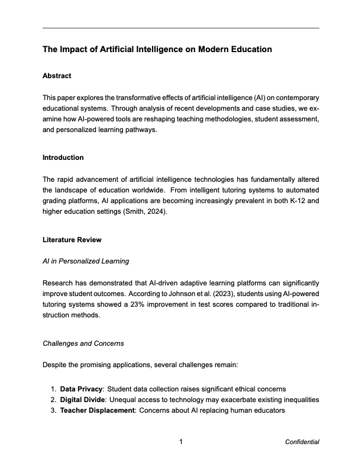
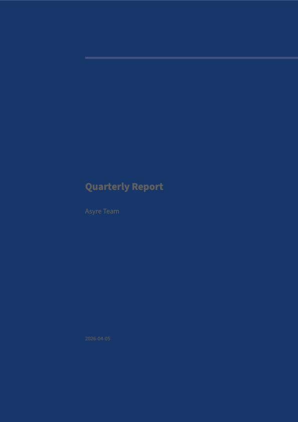

<div align="center">

# Asyre DocForge

> *AI agents think in Markdown. The world runs on PDF and Word.*


</div>

## Why

Every AI agent — Claude, GPT, Copilot — outputs Markdown. But the real world expects APA papers, business proposals, legal contracts, medical reports.

The usual path: agent writes Markdown → human opens Word → spends 30 minutes formatting → exports PDF. Every time.

DocForge eliminates the middle step. One flag, one command — Markdown becomes a properly formatted document in the exact style your industry requires.

```bash
docforge -p apa paper.md          # APA paper, done
docforge -p contract terms.md     # Legal contract, done
docforge -p proposal plan.md      # Business proposal, done
```

No token-heavy prompts asking the AI to "format this as APA with 12pt Times New Roman, double spacing, 1-inch margins..." — the template already knows.

## How It Works

```
Agent output (.md) → docforge -p <preset> → PDF or Word
```

21 presets baked in. Each one encodes the exact font, spacing, margins, headers, and footers for its format. The agent writes content, DocForge handles presentation.

<div align="center">

### One Markdown, many outputs

  

*APA paper · Business proposal · Eisvogel cover page*

</div>

## Presets

```bash
docforge --list-presets
```

| Category | Presets |
|----------|---------|
| **Academic** | `apa` `harvard` `mla` `chicago` `ieee` `vancouver` |
| **Business** | `proposal` `meeting` `memo` |
| **Tech** | `tech-doc` `release-notes` |
| **Legal** | `contract` `legal-brief` |
| **Finance** | `finance` `invoice` |
| **Medical** | `medical` |
| **Government** | `government` |
| **Marketing** | `brand` `marketing` |
| **Education** | `syllabus` `lesson-plan` |
| **Fonts** | `kaiti` `songti` `heiti` `pingfang` `hiragino` |
| **General** | `essay` `report` `book` `slides` `compact` `code` |

Every academic preset supports both PDF and Word output.

## Quick Start

```bash
git clone https://github.com/yzha0302/asyre-docforge.git
cd asyre-docforge
chmod +x docforge.sh install.sh
./install.sh    # symlinks to /usr/local/bin/docforge
```

### Dependencies

```bash
# macOS
brew install pandoc && brew install --cask mactex

# Ubuntu
sudo apt install pandoc texlive-xetex texlive-lang-chinese
```

## Usage

```bash
# PDF (default)
docforge -p apa paper.md

# Word
docforge -p apa --word paper.md
# or
docforge -p apa paper.md paper.docx

# With Eisvogel cover page
docforge -p report --eisvogel --title "Q4 Report" --titlepage report.md

# Custom font + size
docforge -f "Songti SC" -s 12pt --toc document.md

# See all presets
docforge --list-presets

# See available CJK fonts
docforge --list-fonts
```

### Flags

| Flag | Description | Default |
|------|-------------|---------|
| `-p, --preset` | Preset name | pingfang |
| `-w, --word` | Word output | PDF |
| `-f, --font` | Body font | PingFang SC |
| `-m, --mono` | Code font | Heiti SC |
| `-s, --fontsize` | Size | 11pt |
| `--margin` | Margins | 2.5cm |
| `--theme` | Code highlight | tango |
| `-t, --toc` | Table of contents | — |
| `--numbersections` | Section numbers | — |
| `--eisvogel` | Eisvogel template | — |
| `--title` | Title (Eisvogel) | — |
| `--author` | Author (Eisvogel) | — |
| `--titlepage` | Cover page (Eisvogel) | — |

## For Agent Builders

If you're building agents that produce documents, DocForge is a single shell call at the end of your pipeline:

```python
import subprocess

# Agent generates markdown
markdown = agent.run("Write a project proposal for ...")
with open("/tmp/output.md", "w") as f:
    f.write(markdown)

# DocForge formats it
subprocess.run(["docforge", "-p", "proposal", "/tmp/output.md", "/tmp/output.pdf"])
```

The agent doesn't need to know anything about formatting. No extra tokens spent on "use 12pt Arial, 1.5 line spacing, add a confidentiality footer." The preset handles it.

## License

MIT

---

<div align="center">

**Let agents write. Let DocForge format.**


</div>
